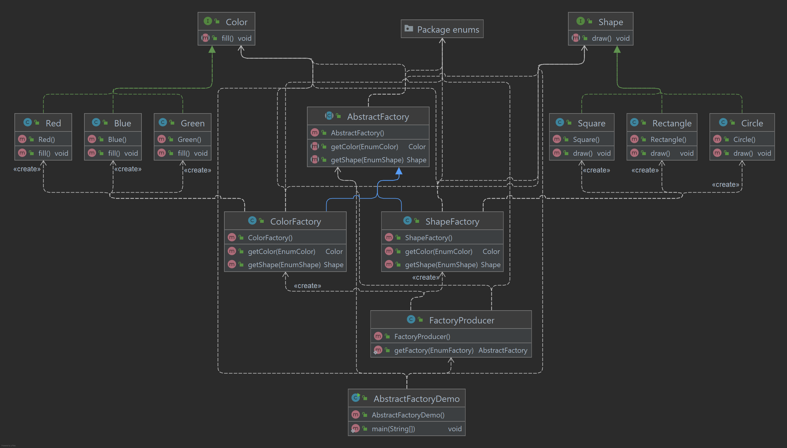

# Abstract Factory Pattern

O Abstract Factory Pattern funciona em torno de uma super-fábrica que cria outras fábricas. Esse fábrica também é
chamada de Fábrica de fábricas. Este tipo de padrão de design vem sob criação padrão, pois este padrão fornece uma das
melhores maneiras de criar um objeto.

No padrão Abstract Factory, uma interface é responsável por criar uma fábrica de objetos relacionados, sem especificar
explicitamente suas classes. Cada fábrica gerada pode dar os objetos de acordo com o Padrão de fábrica.

## Implementação

Vamos criar uma interface Shape e Color classes concretas implementando essas interfaces. Uma classe de fábrica
ShapeFactory Criamos as classes Abstract Factory Pattern, ShapeFactory, ColorFactory, FactoryProducer e
AbstractFactoryDemo.

Um objeto AbstractFactory. Vai passar informações (CÍRCULO / RETANGULO / QUADRADO para Forma)
para AbstractFactory para obter o tipo de objeto de que precisa. Também passa informações (VERMELHO / VERDE / BLUE for
Color) para AbstractFactory para obter o tipo de objeto de que precisa.

_Use as etapas a seguir para implementar o padrão de design mencionado acima._

### Crie uma interface.

~~~java
public interface Shape {
    void draw();
}
~~~

### Crie classes concretas implementando a mesma interface.

~~~java
public class Circle implements Shape {
    @Override
    public void draw() {
        System.out.println("Circle -> draw()");
    }
}
~~~

~~~java
public class Rectangle implements Shape {
    @Override
    public void draw() {
        System.out.println("Rectangle -> draw()");
    }
}
~~~

~~~java
public class Square implements Shape {
    @Override
    public void draw() {
        System.out.println("Square -> draw()");
    }
}
~~~

### Crie uma interface.

~~~java
public interface Shape {
    void fill();
}
~~~

### Crie classes concretas implementando a mesma interface.

~~~java
public class Blue implements Shape {
    @Override
    public void fill() {
        System.out.println("Blue -> fill()");
    }
}
~~~

~~~java
public class Green implements Shape {
    @Override
    public void fill() {
        System.out.println("Green -> fill()");
    }
}
~~~

~~~java
public class Red implements Shape {
    @Override
    public void fill() {
        System.out.println("Red -> fill()");
    }
}
~~~

### Crie uma classe Abstract para obter fábricas para objetos de cores e formas.

~~~java
public abstract class AbstractFactory {
    public abstract Color getColor(EnumColor color);

    public abstract Shape getShape(EnumShape shape);
}
~~~

### Crie um Factory estendendo AbstractFactory para gerar objeto de classe concreta com base nas informações fornecidas.

~~~java
public class ShapeFactory extends AbstractFactory {
    @Override
    public Shape getShape(EnumShape shapeType) {
        return switch (shapeType) {
            case CIRCLE -> new Circle();
            case RECTANGLE -> new Rectangle();
            case SQUARE -> new Square();
            default -> null;
        };
    }

    @Override
    public Color getColor(EnumColor color) {
        return null;
    }
}
~~~

~~~java
public class ColorFactory extends AbstractFactory {
    @Override
    public Color getColor(EnumColor color) {
        return switch (color) {
            case RED -> new Red();
            case GREEN -> new Green();
            case BLUE -> new Blue();
            default -> null;
        };
    }

    @Override
    public Shape getShape(EnumShape shape) {
        return null;
    }
}
~~~

### Crie FactoryProducer para obter fábricas, passando uma informação como Forma ou cor

~~~java
public class FactoryProducer {
    public static AbstractFactory getFactory(EnumFactory choice) {
        return switch (choice) {
            case SHAPE -> new ShapeFactory();
            case COLOR -> new ColorFactory();
            default -> null;
        };
    }
}
~~~

### Use o FactoryProducer para obter AbstractFactory a fim de obter fábricas de classes concretas por passando informações como tipo.

~~~java
public class AbstractFactoryPatternDemo {
    public static void main(String[] args) {
        AbstractFactory shapeFactory = FactoryProducer.getFactory(SHAPE);
        Shape shape1 = shapeFactory.getShape(CIRCLE);
        shape1.draw();
        Shape shape2 = shapeFactory.getShape(RECTANGLE);
        shape2.draw();
        Shape shape3 = shapeFactory.getShape(SQUARE);
        shape3.draw();
        AbstractFactory colorFactory = FactoryProducer.getFactory(COLOR);
        Color color1 = colorFactory.getColor(RED);
        color1.fill();
        Color color2 = colorFactory.getColor(GREEN);
        color2.fill();
        Color color3 = colorFactory.getColor(BLUE);
        color3.fill();
    }
}
~~~

### Saída exibida

    Inside Circle::draw() method.
    Inside Rectangle::draw() method.
    Inside Square::draw() method.
    Inside Red::fill() method.
    Inside Green::fill() method.
    Inside Blue::fill() method.