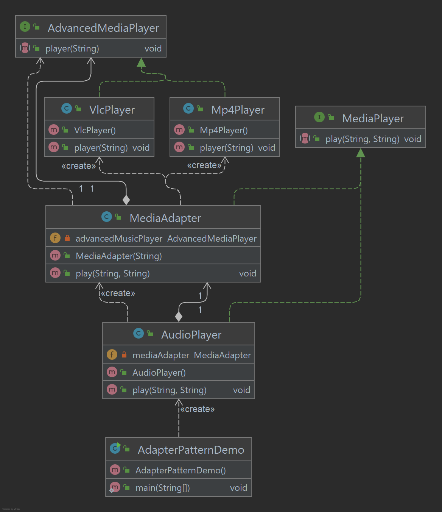

# Adapter Pattern

O Adapter Pattern funciona como uma ponte entre duas interfaces incompatíveis. Este tipo de design pattern vem sob o
padrão estrutural, pois este padrão combina a capacidade de duas interfaces independentes. Este padrão envolve uma única
classe que é responsável por unir funcionalidades de independentes ou interfaces incompatíveis. Um exemplo da vida real
poderia ser um caso de leitor de cartão que atua como um adaptador entre o cartão de memória e um laptop. Você conecta o
cartão de memória ao leitor de cartão e leitor de cartão no laptop para que o cartão de memória possa ser lido através
do laptop. Exemplo abordado, um reprodutor de áudio que pode reproduzir apenas arquivos mp3 e deseja usar um reprodutor
de áudio avançado capaz de reproduzir vlc e arquivos MP4.

Implementação

Temos uma interface MediaPlayer interface e uma classe concreta AudioPlayer implementando a interface do MediaPlayer.
AudioPlayer só pode reproduzir arquivos de áudio no formato mp3. Então temos outra interface AdvancedMediaPlayer e
classes concretas implementando a interface doAdvancedMediaPlayer, onde essas classes podem reproduzir apenas arquivos
de formato vlc e mp4. AdapterPatternDemo, usará a classe AudioPlayer para reproduzir mp3 e usa a classe do adaptador
MediaAdapter para reproduzir formatos surportados.

_Use as etapas a seguir para implementar o padrão de design mencionado acima._

### Crie interfaces para MediaPlayer e AdvancedMediaPlayer.

~~~java
public interface MediaPlayer {
    void play(String audioType, String fileName);
}

public interface AdvancedMediaPlayer {
    void player(String fileName);
}
~~~

### Crie classes concretas implementando a interface AdvancedMediaPlayer.

~~~java
public class Mp4Player implements AdvancedMediaPlayer {

    @Override
    public void player(String fileName) {
        System.out.println("Mp4Player - Name: " + fileName);
    }

}

public class VlcPlayer implements AdvancedMediaPlayer {

    @Override
    public void player(String fileName) {
        System.out.println("VlcPlayer - Name: " + fileName);
    }

}
~~~

### Crie uma classe de adapter implementando a interface MediaPlayer.

~~~java
public class MediaAdapter implements MediaPlayer {

    private AdvancedMediaPlayer advancedMusicPlayer;

    public MediaAdapter(String audioType) {
        switch (audioType) {
            case "mp4" -> advancedMusicPlayer = new Mp4Player();
            case "vlc" -> advancedMusicPlayer = new VlcPlayer();
            default -> {
            }
        }
    }

    @Override
    public void play(String audioType, String fileName) {
        advancedMusicPlayer.player(fileName);
    }

}
~~~

### Crie uma classe concreta implementando a interface MediaPlayer.

~~~java
public class AudioPlayer implements MediaPlayer {

    private MediaAdapter mediaAdapter;

    @Override
    public void play(String audioType, String fileName) {
        switch (audioType) {
            case "mp3" -> System.out.println("AudioPlayer - Name: " + fileName);
            case "mp4", "vlc" -> {
                mediaAdapter = new MediaAdapter(audioType);
                mediaAdapter.play(audioType, fileName);
            }
            default -> System.out.println("Invalid media. " + audioType + " format not supported");
        }
    }
}
~~~

### Use o AudioPlayer para reproduzir diferentes tipos de formatos de áudio.

~~~java
public class AdapterPatternDemo {

    public static void main(String[] args) {
        AudioPlayer audioPlayer = new AudioPlayer();
        audioPlayer.play("mp3", "How Can I Keep From Singing.mp3");
        audioPlayer.play("mp4", "Paul - Apostle of Christ.mp4");
        audioPlayer.play("vlc", "Supernatural.vlc");
        audioPlayer.play("avi", "The Chosen.avi");
    }
}
~~~

### Saída exibida

    AudioPlayer - Name: How Can I Keep From Singing.mp3
    Mp4Player - Name: Paul - Apostle of Christ.mp4
    VlcPlayer - Name: Supernatural.vlc
    Invalid media. avi format not supported