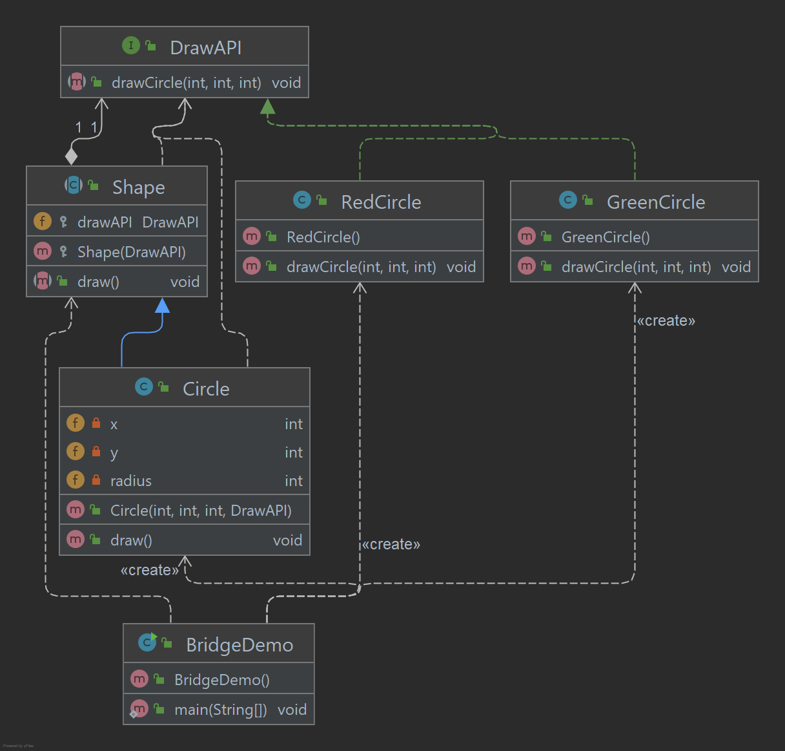

# Bridge Pattern

O Bridge é usado onde precisamos desacoplar uma abstração de sua implementação para que os dois possam variar
independentemente. Este tipo de padrão de projeto vem sob o padrão estrutural como este padrão desacopla a classe de
implementação e a classe abstrata, fornecendo uma estrutura de ponte entre eles.

Este padrão envolve uma interface que atua como uma ponte que torna a funcionalidade das classes concretas independentes
das classes do implementador de interface. Ambos os tipos de classes podem ser alterado estruturalmente sem afetar um ao
outro.

Exemplo: um círculo pode ser desenhado em cores diferentes usando o mesmo método de classe abstrata, mas diferentes
classes de implementando a ponte.

## Implementação

Temos uma interface DrawAPI que atua como um implementador de ponte e como classes concretas temos:
RedCircle, GreenCircle ambas implementando a interface DrawAPI. O Shape é uma classe abstrata e usará o objeto do
DrawAPI. BridgePatternDemo, nossa demonstração usará a classe Shape para desenhar círculos coloridos diferentes.

_Use as etapas a seguir para implementar o padrão de design mencionado acima._

### Crie a interface Bridge.

~~~java
public interface DrawAPI {
    void drawCircle(int radius, int x, int y);
}
~~~

### Crie classes concretas implementando a interface DrawAPI.

~~~java
public class GreenCircle implements DrawAPI {
    @Override
    public void drawCircle(int radius, int x, int y) {
        System.out.println(
                "Drawing Circle[ color: green, radius: " + radius + ", x: " + x + ", " + y + "]"
        );
    }
}

public class RedCircle implements DrawAPI {
    @Override
    public void drawCircle(int radius, int x, int y) {
        System.out.println(
                "Drawing Circle[ color: red, radius: " + radius + ", x: " + x + ", " + y + "]"
        );
    }
}
~~~

### Crie uma classe abstrata Shape implementando a interface DrawAPI.

~~~java
public abstract class Shape {

    protected DrawAPI drawAPI;

    protected Shape(DrawAPI drawAPI) {
        this.drawAPI = drawAPI;
    }

    public abstract void draw();
}
~~~

### Crie uma classe concreta Circle extendendo a classe abstrata Shape.

~~~java
public class Circle extends Shape {

    private int x;
    private int y;
    private int radius;

    public Circle(int x, int y, int radius, DrawAPI drawAPI) {
        super(drawAPI);
        this.x = x;
        this.y = y;
        this.radius = radius;
    }

    @Override
    public void draw() {
        drawAPI.drawCircle(radius, x, y);
    }
}
~~~

### Use as classes Shape e DrawAPI para desenhar círculos de cores diferentes.

~~~java
public class BridgePatternDemo {

    public static void main(String[] args) {

        Shape redCircle = new Circle(100, 100, 10, new RedCircle());
        Shape greenCircle = new Circle(100, 100, 10, new GreenCircle());
        redCircle.draw();
        greenCircle.draw();

    }
}
~~~

### Saída exibida

    Drawing Circle[ color: red, radius: 10, x: 100, 100]
    Drawing Circle[ color: green, radius: 10, x: 100, 100]