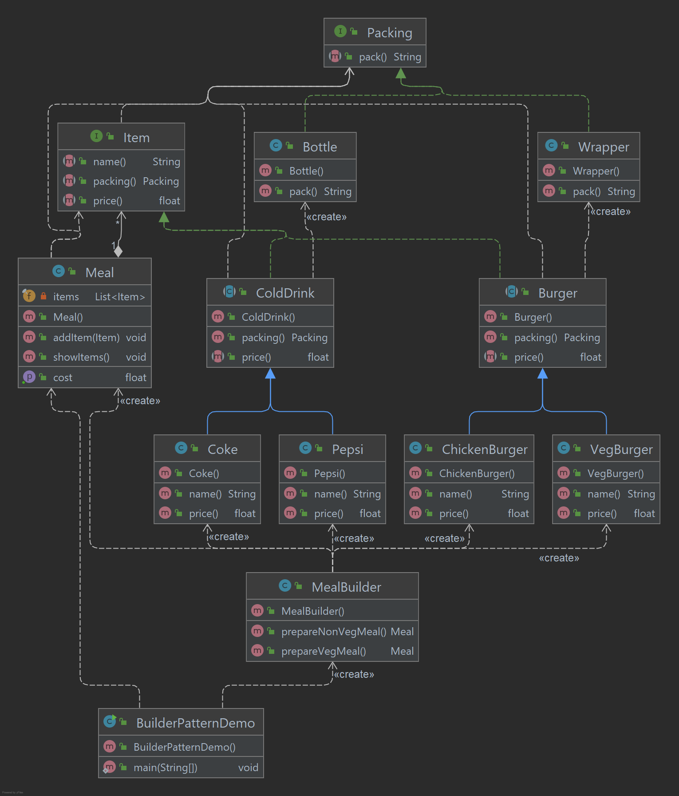

# Builder Pattern

O Builder Pattern constrói um objeto complexo usando objetos simples e usando um passo a passo abordagem. Este tipo de
padrão de design vem sob o padrão de criação, pois este padrão fornece uma das melhores maneiras de criar um objeto.

Uma classe Builder constrói o objeto final passo a passo. Este construtor é independente de outros objetos.

## Implementação

O exemplo trata o caso de negócios de restaurante fast-food, onde uma refeição típica poderia ser um hambúrguer e uma
bebida gelada. O Hambúrguer pode ser um Hambúrguer Vegetariano ou Hambúrguer de Frango contida em uma embalagem. A
bebida gelada pode ser uma coca ou pepsi e será vendida como uma garrafa.

Vamos criar uma interface de item que representa itens alimentares, como hambúrgueres e bebidas frias e classes
concretas implementando a interface Item e uma interface Packing representando embalagem de itens alimentícios e classes
de concretas implementando a interface de embalagem como hambúrguer contido em uma embalagem e a bebida gelada seria em
garrafa. Em seguida, criamos uma classe Meal tendo ArrayList of Item e um MealBuilder para construir diferentes tipos de
MealObject combinando Itens. BuilderPatternDemo, nossa classe de demonstração usará MealBuilder para construir uma
refeição.

_Use as etapas a seguir para implementar o padrão de design mencionado acima._

### Crie uma interface que representa o item e outra para representar a embalagem

~~~java
public interface Item {
    String name();

    Packing packing();

    float price();
}

public interface Packing {
    String pack();
}
~~~

### Crie classes concretas implementando a interface Packing(embalagem).

~~~java
public class Bottle implements Packing {
    @Override
    public String pack() {
        return "Bottle";
    }
}

public class Wrapper implements Packing {
    @Override
    public String pack() {
        return "Wrapper";
    }
}
~~~

### Crie classes abstratas implementando a interface do item fornecendo funcionalidades padrão.

~~~java
public abstract class Burger implements Item {
    @Override
    public Packing packing() {
        return new Wrapper();
    }

    @Override
    public abstract float price();
}

public abstract class ColdDrink implements Item {
    @Override
    public Packing packing() {
        return new Bottle();
    }

    @Override
    public abstract float price();
}
~~~

### Crie classes concretas estendendo as classes Burger e ColdDrink

~~~java
public class VegBurger extends Burger {
    @Override
    public String name() {
        return "Veg Burger";
    }

    @Override
    public float price() {
        return 25.0f;
    }
}

public class ChickenBurger extends Burger {
    @Override
    public String name() {
        return "Chicken Burger";
    }

    @Override
    public float price() {
        return 35.0f;
    }
}

public class Coke extends ColdDrink {
    @Override
    public String name() {
        return "Coke";
    }

    @Override
    public float price() {
        return 5.0f;
    }
}

public class Pepsi extends ColdDrink {
    @Override
    public String name() {
        return "Pepsi";
    }

    @Override
    public float price() {
        return 5.0f;
    }
}
~~~

### Crie uma classe Meal(refeição) com os objetos item definidos anteriormente.

~~~java
public class Meal {
    private final List<Item> items = new ArrayList<>();

    public void addItem(Item item) {
        items.add(item);
    }

    public float getCost() {
        float cost = 0.0f;
        for (Item item : items) {
            cost += item.price();
        }
        return cost;
    }

    public void showItems() {
        for (Item item : items) {
            System.out.print("Item -> " + item.name());
            System.out.print(", Packing -> " + item.packing().pack());
            System.out.println(", Price -> " + item.price());
        }
    }
}
~~~

### Crie uma classe MealBuilder, a classe construtora real responsável por criar objetos Meal(refeição).

~~~java
public class MealBuilder {
    public Meal prepareVegMeal() {
        Meal meal = new Meal();
        meal.addItem(new VegBurger());
        meal.addItem(new Coke());
        return meal;
    }

    public Meal prepareNonVegMeal() {
        Meal meal = new Meal();
        meal.addItem(new ChickenBurger());
        meal.addItem(new Pepsi());
        return meal;
    }
}
~~~

### BuiderPatternDemo usa MealBuider para demonstrar o padrão do construtor.

~~~java
public class BuilderPatternDemo {
    public static void main(String[] args) {
        MealBuilder mealBuilder = new MealBuilder();
        Meal vegMeal = mealBuilder.prepareVegMeal();
        System.out.println("Veg Meal");
        vegMeal.showItems();
        System.out.println("Total Cost: " + vegMeal.getCost());
        Meal nonVegMeal = mealBuilder.prepareNonVegMeal();
        System.out.println("\nNon-Veg Meal");
        nonVegMeal.showItems();
        System.out.println("Total Cost: " + nonVegMeal.getCost());
    }
}
~~~

### Saída exibida

    Veg Meal
    Item -> Veg Burger, Packing -> Wrapper, Price -> 25.0
    Item -> Coke, Packing -> Bottle, Price -> 5.0
    Total Cost: 30.0

    Non-Veg Meal
    Item -> Chicken Burger, Packing -> Wrapper, Price -> 35.0
    Item -> Pepsi, Packing -> Bottle, Price -> 5.0
    Total Cost: 40.0