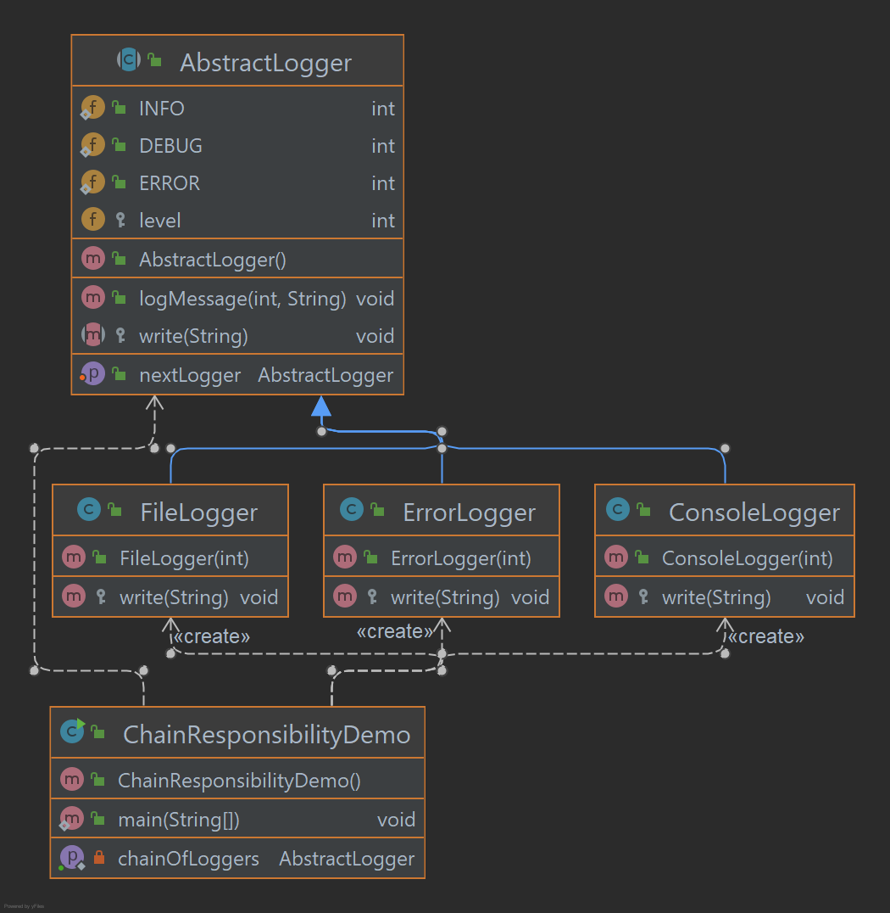

# Chain Responsibility Pattern

Como o nome sugere, o padrão de cadeia de responsabilidade cria uma cadeia de objetos receptores para uma solicitação.
Este padrão separa o remetente e o destinatário de uma solicitação com base no tipo de solicitação. 
Esse padrão está incluído nos padrões comportamentais. Neste padrão, normalmente cada receptor contém referência 
a outro receptor. Se um objeto não puder lidar com a solicitação, ele passará a mesma para o próximo receptor e assim por diante.

## Implementação

Criamos uma classe abstrata AbstractLogger com um nível de registro. Em seguida, criamos três tipos de registradores 
que estendem o AbstractLogger. Cada registrador verifica o nível da mensagem em seu nível e imprime de acordo, 
caso contrário não imprime e passa a mensagem para seu próximo registrador.

_Use as etapas a seguir para implementar o padrão de design mencionado acima._

### Crie uma classe de criador de logs abstrata.

~~~java
public abstract class AbstractLogger {

    public static int INFO = 1;
    public static int DEBUG = 2;
    public static int ERROR = 3;
    protected int level;

    protected AbstractLogger nextLogger;

    public void setNextLogger(AbstractLogger nextLogger) {
        this.nextLogger = nextLogger;
    }

    public void logMessage(int level, String message) {
        if (this.level <= level) {
            write(message);
        }
        if (nextLogger != null) {
            nextLogger.logMessage(level, message);
        }
    }

    abstract protected void write(String message);

}
~~~

### Crie classes concretas estendendo o criador de logs.

~~~java
public class ConsoleLogger extends AbstractLogger {

    public ConsoleLogger(int level) {
        this.level = level;
    }

    @Override
    protected void write(String message) {
        System.out.println("Standard Console::Logger: " + message);
    }

}

public class ErrorLogger extends AbstractLogger {

    public ErrorLogger(int level) {
        this.level = level;
    }

    @Override
    protected void write(String message) {
        System.out.println("Error Console::Logger: " + message);
    }

}

public class FileLogger extends AbstractLogger {

    public FileLogger(int level) {
        this.level = level;
    }

    @Override
    protected void write(String message) {
        System.out.println("File::Logger: " + message);
    }

}
~~~

### Crie diferentes tipos de registradores. Atribua-lhes níveis de erro e defina o próximo registrador em cada registrador. O próximo registrador em cada registrador representa a parte da cadeia.

~~~java
public class ChainResponsibilityDemo {

    private static AbstractLogger getChainOfLoggers() {
        AbstractLogger errorLogger = new ErrorLogger(AbstractLogger.ERROR);
        AbstractLogger fileLogger = new FileLogger(AbstractLogger.DEBUG);
        AbstractLogger consoleLogger = new ConsoleLogger(AbstractLogger.INFO);
        errorLogger.setNextLogger(fileLogger);
        fileLogger.setNextLogger(consoleLogger);
        return errorLogger;
    }

    public static void main(String[] args) {
        AbstractLogger loggerChain = getChainOfLoggers();
        loggerChain.logMessage(AbstractLogger.INFO, "This is an information.");
        loggerChain.logMessage(AbstractLogger.DEBUG, "This is an debug level information.");
        loggerChain.logMessage(AbstractLogger.ERROR, "This is an error information.");
    }

}
~~~

### Saída exibida

    Standard Console::Logger: This is an information.
    File::Logger: This is an debug level information.
    Standard Console::Logger: This is an debug level information.
    Error Console::Logger: This is an error information.
    File::Logger: This is an error information.
    Standard Console::Logger: This is an error information.