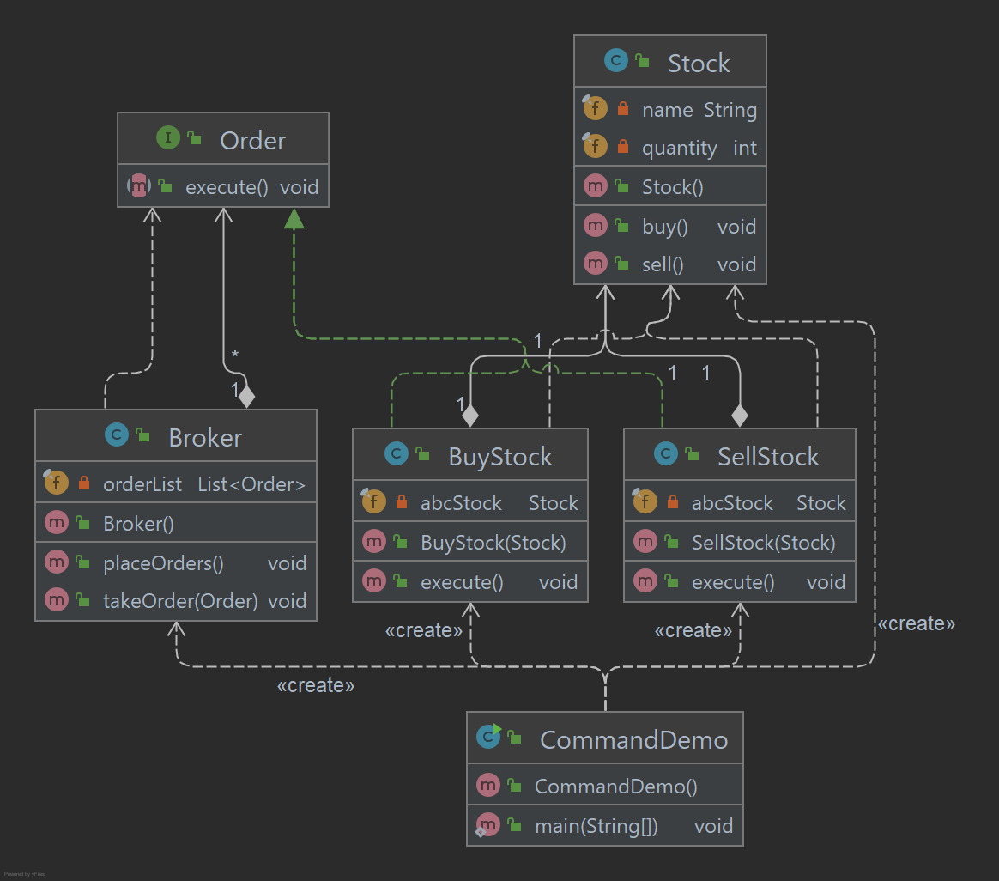

# Command Pattern

O padrão de comando é um padrão de design baseado em dados e se enquadra na categoria de padrão comportamental. 
Uma solicitação é agrupada em um objeto como comando e passada para o objeto invocador. 
O objeto Invoker procura o objeto apropriado que pode manipular este comando e passa o comando para o objeto 
correspondente e esse objeto executa o comando.

## Implementação

Criamos uma interface Order que atua como um comando. Criamos uma classe Stock que funciona como uma solicitação. 
Temos classes de comando concretas BuyStock e SellStock implementando OrderInterface que fará o processamento real do comando.
É criada uma classe Broker que atua como um objeto invocador.
Pode receber pedidos e fazer pedidos.
O objeto Broker usa padrão de comando para identificar qual objeto executará qual comando com base no tipo de comando.
CommandDemo, nossa classe de demonstração usará a classe Broker para demonstrar o padrão de comando.

_Use as etapas a seguir para implementar o padrão de design mencionado acima._

### Crie uma interface.

~~~java
public interface Order {
    void execute();
}
~~~

### Crie uma classe de solicitação.

~~~java
public class Stock {

    private final String name = "ABC";
    private final int quantity = 10;

    public void buy() {
        System.out.println("Stock [ Name: " + name + ", Quantity: " + quantity + " ] bought");
    }

    public void sell() {
        System.out.println("Stock [ Name: " + name + ", Quantity: " + quantity + " ] sold");
    }

}
~~~

### Crie classes concretas implementando a interface Order.

~~~java
public class BuyStock implements Order {

    private final Stock abcStock;

    public BuyStock(Stock abcStock) {
        this.abcStock = abcStock;
    }

    public void execute() {
        abcStock.buy();
    }

}

public class SellStock implements Order {

    private final Stock abcStock;

    public SellStock(Stock abcStock) {
        this.abcStock = abcStock;
    }

    public void execute() {
        abcStock.sell();
    }

}
~~~

### Crie uma classe invocadora de comando.

~~~java
public class Broker {

    private final List<Order> orderList = new ArrayList<>();

    public void takeOrder(Order order) {
        orderList.add(order);
    }

    public void placeOrders() {
        for (Order order : orderList) {
            order.execute();
        }
        orderList.clear();
    }

}
~~~

### Use a classe Broker para receber e executar comandos.

~~~java
public class CommandDemo {

    public static void main(String[] args) {

        Stock abcStock = new Stock();
        BuyStock buyStockOrder = new BuyStock(abcStock);
        SellStock sellStockOrder = new SellStock(abcStock);
        Broker broker = new Broker();
        broker.takeOrder(buyStockOrder);
        broker.takeOrder(sellStockOrder);
        broker.placeOrders();

    }

}
~~~

### Saída exibida

    Stock [ Name: ABC, Quantity: 10 ] bought
    Stock [ Name: ABC, Quantity: 10 ] sold