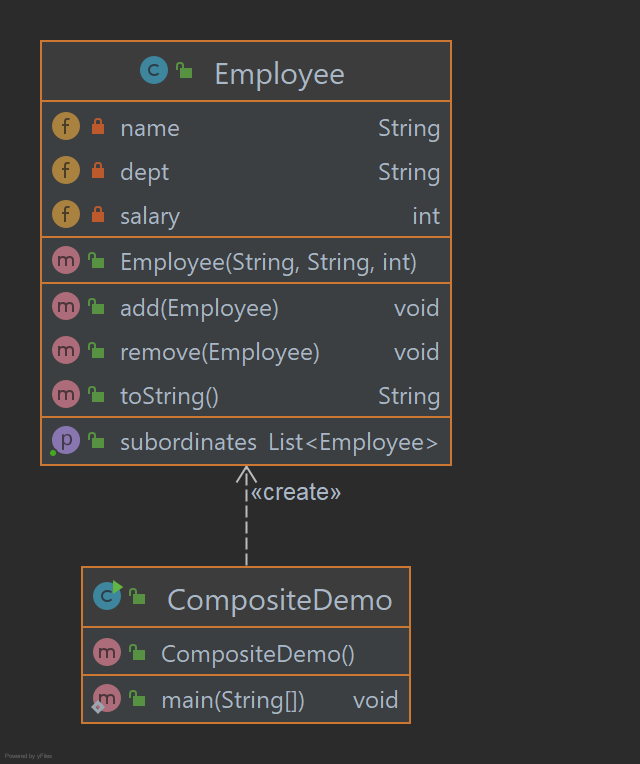

# Composite Pattern

O padrão Composite é usado quando precisamos tratar um grupo de objetos de maneira semelhante a um único objeto. 
O padrão Composite compõe objetos em termos de uma estrutura de árvore para representar hierarquias parciais e inteiras.
Este tipo de padrão de design está incluído no padrão estrutural, pois cria uma estrutura em árvore de grupo de objetos.
Este padrão cria uma classe que contém um grupo de seus próprios objetos. Esta classe fornece maneiras de modificar seu
grupo de mesmos objetos. Estamos demonstrando o uso do padrão Composite por meio do exemplo a seguir, que mostra a 
hierarquia dos funcionários de uma organização.

## Implementação

Temos uma classe Employee que atua como classe de ator de padrão composto. CompositePatternDemo, nossa classe de 
demonstração usará a classe Employee para adicionar hierarquia em nível de departamento e imprimir todos os funcionários.

_Use as etapas a seguir para implementar o padrão de design mencionado acima._

### Crie a classe Employee com uma lista de objetos Employee.

~~~java
public class Employee {

    private String name;
    private String dept;
    private int salary;
    private List<Employee> subordinates;

    public Employee(String name, String dept, int salary) {
        this.name = name;
        this.dept = dept;
        this.salary = salary;
        subordinates = new ArrayList<>();
    }

    public void add(Employee e) {
        subordinates.add(e);
    }

    public void remove(Employee e) {
        subordinates.remove(e);
    }

    public List<Employee> getSubordinates() {
        return subordinates;
    }

    public String toString() {
        return ("Employee :[ Name : " + name + ", dept : " + dept + ", salary :" + salary + " ]");
    }
}
~~~

### Use a classe Employee para criar e imprimir a hierarquia de funcionários.

~~~java
public class CompositeDemo {

    public static void main(String[] args) {
        Employee CEO = new Employee("Tony Stark", "CEO", 30000);

        Employee headSales = new Employee("Steve Rogers", "Head Sales", 20000);
        Employee headMarketing = new Employee("Bruce Banner", "Head Marketing", 20000);
        Employee clerk1 = new Employee("Natasha", "Marketing", 10000);
        Employee clerk2 = new Employee("Vespa", "Marketing", 10000);
        Employee salesExecutive1 = new Employee("Hulk", "Sales", 10000);
        Employee salesExecutive2 = new Employee("Thor", "Sales", 10000);
        CEO.add(headSales);
        CEO.add(headMarketing);
        headSales.add(salesExecutive1);
        headSales.add(salesExecutive2);
        headMarketing.add(clerk1);
        headMarketing.add(clerk2);

        System.out.println(CEO);
        for (Employee headEmployee : CEO.getSubordinates()) {
            System.out.println(headEmployee);
            for (Employee employee : headEmployee.getSubordinates()) {
                System.out.println(employee);
            }
        }
    }

}
~~~

### Saída exibida

    Employee :[ Name : Tony Stark, dept : CEO, salary :30000 ]
    Employee :[ Name : Steve Rogers, dept : Head Sales, salary :20000 ]
    Employee :[ Name : Hulk, dept : Sales, salary :10000 ]
    Employee :[ Name : Thor, dept : Sales, salary :10000 ]
    Employee :[ Name : Bruce Banner, dept : Head Marketing, salary :20000 ]
    Employee :[ Name : Natasha, dept : Marketing, salary :10000 ]
    Employee :[ Name : Vespa, dept : Marketing, salary :10000 ]