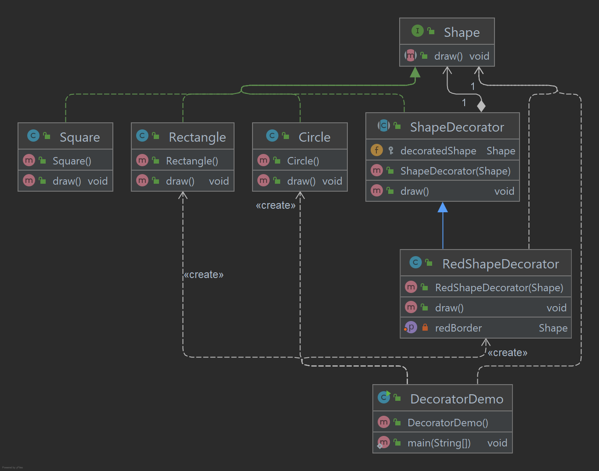

# Decorator Pattern

O padrão Decorator permite adicionar novas funcionalidades a um objeto existente sem alterar sua estrutura.
Este tipo de padrão de design está incluído no padrão estrutural, pois atua como um wrapper para a classe existente.
Este padrão cria uma classe decoradora que envolve a classe original e fornece funcionalidade adicional, mantendo 
intacta a assinatura dos métodos de classe. Estou demonstrando o uso do padrão Decorator através do seguinte exemplo, 
no qual decoraremos uma forma com alguma cor sem alterar a classe de forma.

## Implementação

Vamos criar uma interface Shape e classes concretas implementando a interface Shape. Em seguida, criamos uma classe de 
decorador abstrata ShapeDecorator implementando a interface Shape e tendo o objeto Shape como sua variável de instância.
RedShapeDecorator é uma classe concreta que implementa ShapeDecorator. DecoratorPatternDemo, nossa classe de demonstração
usará RedShapeDecorator para decorar objetos Shape.

_Use as etapas a seguir para implementar o padrão de design mencionado acima._

### Crie uma interface.

~~~java
public interface Shape {
    void draw();
}
~~~

### Crie classes concretas implementando a interface Shape.

~~~java
public class Circle implements Shape {
    @Override
    public void draw() {
        System.out.println("Circle -> draw()");
    }
}

public class Rectangle implements Shape {
    @Override
    public void draw() {
        System.out.println("Rectangle -> draw()");
    }
}

public class Square implements Shape {
    @Override
    public void draw() {
        System.out.println("Square -> draw()");
    }
}
~~~

### Crie uma classe de decorador abstrata implementando a interface Shape.

~~~java
public abstract class ShapeDecorator implements Shape {

    protected Shape decoratedShape;

    public ShapeDecorator(Shape decoratedShape) {
        this.decoratedShape = decoratedShape;
    }

    public void draw() {
        decoratedShape.draw();
    }
}
~~~

### Crie uma classe decorator concreta estendendo a classe ShapeDecorator.

~~~java
public class RedShapeDecorator extends ShapeDecorator {

    public RedShapeDecorator(Shape decoratedShape) {
        super(decoratedShape);
    }

    @Override
    public void draw() {
        decoratedShape.draw();
        setRedBorder(decoratedShape);
    }

    private void setRedBorder(Shape decoratedShape) {
        System.out.println("Border Color -> Red");
    }
}
~~~

### Use o RedShapeDecorator para decorar objetos Shape.

~~~java
public class DecoratorDemo {

    public static void main(String[] args) {

        Shape circle = new Circle();
        Shape redCircle = new RedShapeDecorator(new Circle());
        Shape redRectangle = new RedShapeDecorator(new Rectangle());

        System.out.println("Circle with normal border");
        circle.draw();

        System.out.println("\nCircle of red border");
        redCircle.draw();

        System.out.println("\nRectangle of red border");
        redRectangle.draw();
    }

}
~~~

### Saída exibida

    Circle with normal border
    Circle -> draw()
    
    Circle of red border
    Circle -> draw()
    Border Color -> Red
    
    Rectangle of red border
    Rectangle -> draw()
    Border Color -> Red