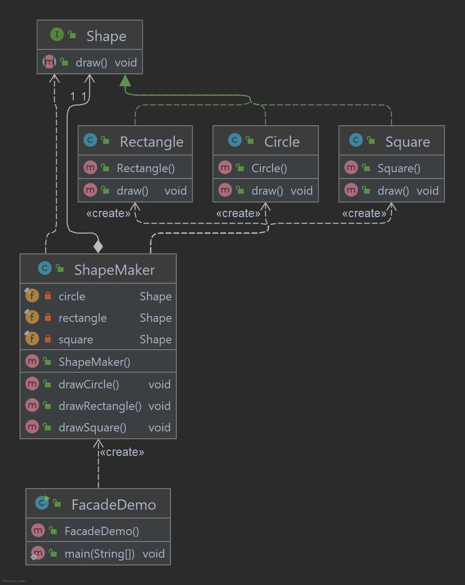

# Facade Pattern

O padrão Facade esconde as complexidades do sistema e fornece uma interface para o cliente através da qual o cliente 
pode acessar o sistema. Este tipo de padrão de design está incluído no padrão estrutural, pois adiciona uma interface 
ao sistema existente para ocultar suas complexidades. Este padrão envolve uma única classe que fornece métodos 
simplificados que são exigidos pelo cliente e delega chamadas para métodos de classes de sistema existentes.

## Implementação

Vamos criar uma interface Shape e classes concretas implementando a interface Shape. Uma classe de fachada ShapeMaker 
é definida como a próxima etapa. A classe ShapeMaker usa as classes concretas para delegar chamadas de usuário para 
essas classes. FacadeDemo, nossa classe de demonstração usará a classe ShapeMaker para mostrar os resultados.

_Use as etapas a seguir para implementar o padrão de design mencionado acima._

### Crie uma interface..

~~~java
public interface Shape {
    void draw();
}
~~~

### Crie classes concretas implementando a interface Shape.

~~~java
public class Circle implements Shape {
    @Override
    public void draw() {
        System.out.println("Circle -> draw()");
    }
}

public class Rectangle implements Shape {
    @Override
    public void draw() {
        System.out.println("Rectangle -> draw()");
    }
}

public class Square implements Shape {
    @Override
    public void draw() {
        System.out.println("Square -> draw()");
    }
}
~~~

### Crie uma classe de facade.

~~~java
public class ShapeMaker {

    private final Shape circle;
    private final Shape rectangle;
    private final Shape square;

    public ShapeMaker() {
        circle = new Circle();
        rectangle = new Rectangle();
        square = new Square();
    }

    public void drawCircle() {
        circle.draw();
    }

    public void drawRectangle() {
        rectangle.draw();
    }

    public void drawSquare() {
        square.draw();
    }
}
~~~

### Use a facade para desenhar vários tipos de formas.

~~~java
public class FacadeDemo {

    public static void main(String[] args) {

        ShapeMaker shapeMaker = new ShapeMaker();
        shapeMaker.drawCircle();
        shapeMaker.drawRectangle();
        shapeMaker.drawSquare();

    }
}
~~~

### Saída exibida

    Circle -> draw()
    Rectangle -> draw()
    Square -> draw()