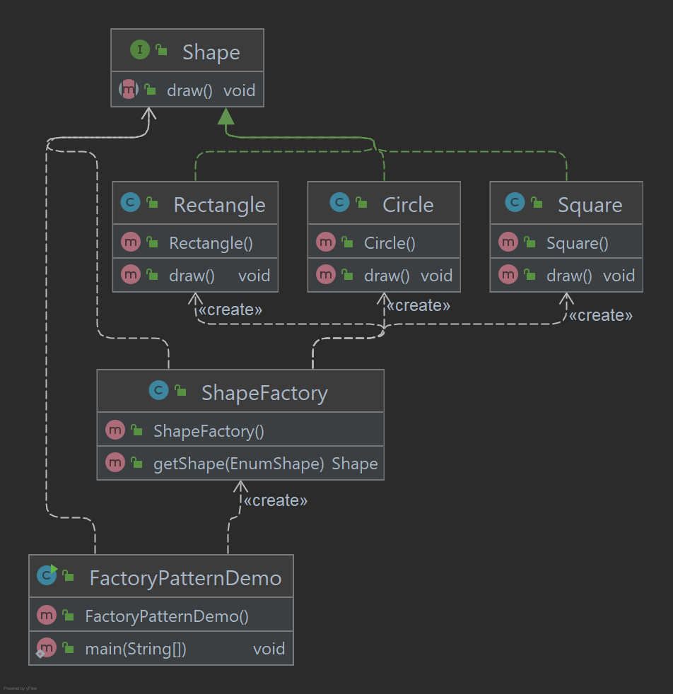

# Factory Pattern

O Factory Pattern é um dos padrões de design mais usados em Java. Este tipo de padrão de design vem sob o padrão de
criação, pois esse padrão fornece uma das melhores maneiras de criar um objeto. No padrão de fábrica, criamos objeto sem
expor a lógica de criação para o cliente e nos referimos a objeto recém-criado usando uma interface comum.

## Implementação

Vamos criar uma interface Shape e classes concretas implementando a interface Shape. Uma classe de fábrica ShapeFactory
é definida como uma próxima etapa.

Usaremos a ShapeFactory para obter um objeto Shape, passando informações (CIRCLE / RECTANGLE / SQUARE) para ShapeFactory
para obter o tipo de objeto que precisa.

_Use as etapas a seguir para implementar o padrão de design mencionado acima._

### Crie uma interface.

~~~java
public interface Shape {
    void draw();
}
~~~

### Crie classes concretas implementando a mesma interface.

~~~java
public class Circle implements Shape {
    @Override
    public void draw() {
        System.out.println("Circle -> draw()");
    }
}
~~~

~~~java
public class Rectangle implements Shape {
    @Override
    public void draw() {
        System.out.println("Rectangle -> draw()");
    }
}
~~~

~~~java
public class Square implements Shape {
    @Override
    public void draw() {
        System.out.println("Square -> draw()");
    }
}
~~~

### Crie um Factory para gerar objeto de classe concreta com base nas informações fornecidas.

~~~java
public class ShapeFactory {
    public Shape getShape(EnumShape shapeType) {
        return switch (shapeType) {
            case CIRCLE -> new Circle();
            case RECTANGLE -> new Rectangle();
            case SQUARE -> new Square();
            default -> null;
        };
    }
}
~~~

### Use o Factory para obter o objeto da classe concreta passando uma informação como tipo.

~~~java
public class FactoryPatternDemo {
    public static void main(String[] args) {
        ShapeFactory shapeFactory = new ShapeFactory();
        Shape shape1 = shapeFactory.getShape(CIRCLE);
        shape1.draw();
        Shape shape2 = shapeFactory.getShape(RECTANGLE);
        shape2.draw();
        Shape shape3 = shapeFactory.getShape(SQUARE);
        shape3.draw();
    }
}
~~~

### Saída exibida

    Circle -> draw()
    Rectangle -> draw()
    Square -> draw()