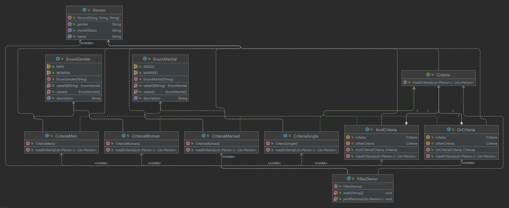

# Filter Pattern or Criteria Pattern

O Filter Pattern ou Criteria Pattern é um padrão de design que permite aos desenvolvedores filtrar um conjunto de
objetos, usando critérios diferentes, encadeando-os de forma desacoplada por meio de operações lógicas. Este tipo de
padrão de design vem sob o padrão estrutural, pois este padrão combina vários critérios para obter critérios únicos.

## Implementação

Vamos criar um objeto Person, interface Criteria e classes concretas implementando este interface para filtrar a lista
de objetos Person. CriteriaPatternDemo, usa objetos Criteria para filtrar objetos Lista de Pessoa com base em vários
critérios e suas combinações.

_Use as etapas a seguir para implementar o padrão de design mencionado acima._

### Crie uma classe na qual os critérios sejam aplicados.

~~~java
public class Person {

    private String name;
    private String gender;
    private String maritalStatus;

    public Person(String name, String gender, String maritalStatus) {
        this.name = name;
        this.gender = gender;
        this.maritalStatus = maritalStatus;
    }

    public String getName() {
        return name;
    }

    public void setName(String name) {
        this.name = name;
    }

    public String getGender() {
        return gender;
    }

    public void setGender(String gender) {
        this.gender = gender;
    }

    public String getMaritalStatus() {
        return maritalStatus;
    }

    public void setMaritalStatus(String maritalStatus) {
        this.maritalStatus = maritalStatus;
    }
}
~~~

### Crie uma interface.

~~~java
public interface Criteria {

    List<Person> meetCriteria(List<Person> persons);

}
~~~

### Crie classes concretas implementando a interface Criteria..

~~~java
public class CriteriaMen implements Criteria {

    @Override
    public List<Person> meetCriteria(List<Person> persons) {
        List<Person> menPersons = new ArrayList<>();
        for (Person person : persons) {
            if (person.getGender().equalsIgnoreCase(EnumGender.MEN.getDescription())) {
                menPersons.add(person);
            }
        }
        return menPersons;
    }

}

public class CriteriaWoman implements Criteria {

    @Override
    public List<Person> meetCriteria(List<Person> persons) {
        List<Person> womanPersons = new ArrayList<>();
        for (Person person : persons) {
            if (person.getGender().equalsIgnoreCase(EnumGender.WOMAN.getDescription())) {
                womanPersons.add(person);
            }
        }
        return womanPersons;
    }

}

public class CriteriaSingle implements Criteria {

    @Override
    public List<Person> meetCriteria(List<Person> persons) {
        List<Person> singlePersons = new ArrayList<>();
        for (Person person : persons) {
            if (person.getMaritalStatus().equalsIgnoreCase(EnumMarital.SINGLE.getDescription())) {
                singlePersons.add(person);
            }
        }
        return singlePersons;
    }

}

public class CriteriaMarried implements Criteria {

    @Override
    public List<Person> meetCriteria(List<Person> persons) {
        List<Person> maritalPersons = new ArrayList<>();
        for (Person person : persons) {
            if (person.getMaritalStatus().equalsIgnoreCase(EnumMarital.MARRIED.getDescription())) {
                maritalPersons.add(person);
            }
        }
        return maritalPersons;
    }

}

public class AndCriteria implements Criteria {

    private Criteria criteria;
    private Criteria otherCriteria;

    public AndCriteria(Criteria criteria, Criteria otherCriteria) {
        this.criteria = criteria;
        this.otherCriteria = otherCriteria;
    }

    @Override
    public List<Person> meetCriteria(List<Person> persons) {
        List<Person> firstCriteriaPersons = criteria.meetCriteria(persons);
        return otherCriteria.meetCriteria(firstCriteriaPersons);
    }

}

public class OrCriteria implements Criteria {

    private Criteria criteria;
    private Criteria otherCriteria;

    public OrCriteria(Criteria criteria, Criteria otherCriteria) {
        this.criteria = criteria;
        this.otherCriteria = otherCriteria;
    }

    @Override
    public List<Person> meetCriteria(List<Person> persons) {
        List<Person> firstCriteriaItems = criteria.meetCriteria(persons);
        List<Person> otherCriteriaItems =
                otherCriteria.meetCriteria(persons);
        for (Person person : otherCriteriaItems) {
            if (!firstCriteriaItems.contains(person)) {
                firstCriteriaItems.add(person);
            }
        }
        return firstCriteriaItems;
    }

}
~~~

### Use critérios diferentes e suas combinações para filtrar as pessoas.

~~~java
public class CriteriaPatternDemo {

    public static void main(String[] args) {

        List<Person> persons = new ArrayList<>();
        persons.add(new Person("TONY STARK", "MEN", "SINGLE"));
        persons.add(new Person("STEVE ROGERS", "MEN", "MARRIED"));
        persons.add(new Person("PEPPER POTTS", "WOMAN", "MARRIED"));
        persons.add(new Person("NATASHA ROMANOFF", "WOMAN", "SINGLE"));
        persons.add(new Person("CLINT BARTON", "MEN", "SINGLE"));
        persons.add(new Person("THOR", "MEN", "SINGLE"));

        Criteria men = new CriteriaMen();
        Criteria woman = new CriteriaWoman();
        Criteria single = new CriteriaSingle();
        Criteria married = new CriteriaMarried();

        Criteria singleAndMen = new AndCriteria(single, men);
        Criteria singleAndWoman = new AndCriteria(single, woman);

        Criteria marriedAndMen = new AndCriteria(married, men);
        Criteria marriedAndWoman = new AndCriteria(married, woman);

        Criteria singleOrMale = new OrCriteria(single, men);
        Criteria marriedOrWoman = new OrCriteria(married, woman);

        System.out.println("CRITERIA [ GENDER MEN ]");
        printPersons(men.meetCriteria(persons));

        System.out.println("\nCRITERIA [ GENDER WOMAN ]");
        printPersons(woman.meetCriteria(persons));

        System.out.println("\nCRITERIA [ SINGLE AND MEN ]");
        printPersons(singleAndMen.meetCriteria(persons));

        System.out.println("\nCRITERIA [ SINGLE AND WOMAN ]");
        printPersons(singleAndWoman.meetCriteria(persons));

        System.out.println("\nCRITERIA [ MARRIED AND MEN ]");
        printPersons(marriedAndMen.meetCriteria(persons));

        System.out.println("\nCRITERIA [ MARRIED AND WOMAN ]");
        printPersons(marriedAndWoman.meetCriteria(persons));

        System.out.println("\nCRITERIA [ SINGLE OR MEN ]");
        printPersons(singleOrMale.meetCriteria(persons));

        System.out.println("\nCRITERIA [ MARRIED OR WOMAN ]");
        printPersons(marriedOrWoman.meetCriteria(persons));

    }

    public static void printPersons(List<Person> persons) {
        for (Person person : persons) {
            System.out.println(
                    "Person : [ Name : " + person.getName()
                            + ", Gender : " + person.getGender()
                            + ", Marital Status : " + person.getMaritalStatus()
                            + " ]"
            );
        }
    }

}
~~~

### Saída exibida

    CRITERIA [ GENDER MEN ]
    Person : [ Name : TONY STARK, Gender : MEN, Marital Status : SINGLE ]
    Person : [ Name : STEVE ROGERS, Gender : MEN, Marital Status : MARRIED ]
    Person : [ Name : CLINT BARTON, Gender : MEN, Marital Status : SINGLE ]
    Person : [ Name : THOR, Gender : MEN, Marital Status : SINGLE ]
    
    CRITERIA [ GENDER WOMAN ]
    Person : [ Name : PEPPER POTTS, Gender : WOMAN, Marital Status : MARRIED ]
    Person : [ Name : NATASHA ROMANOFF, Gender : WOMAN, Marital Status : SINGLE ]
    
    CRITERIA [ SINGLE AND MEN ]
    Person : [ Name : TONY STARK, Gender : MEN, Marital Status : SINGLE ]
    Person : [ Name : CLINT BARTON, Gender : MEN, Marital Status : SINGLE ]
    Person : [ Name : THOR, Gender : MEN, Marital Status : SINGLE ]
    
    CRITERIA [ SINGLE AND WOMAN ]
    Person : [ Name : NATASHA ROMANOFF, Gender : WOMAN, Marital Status : SINGLE ]
    
    CRITERIA [ MARRIED AND MEN ]
    Person : [ Name : STEVE ROGERS, Gender : MEN, Marital Status : MARRIED ]
    
    CRITERIA [ MARRIED AND WOMAN ]
    Person : [ Name : PEPPER POTTS, Gender : WOMAN, Marital Status : MARRIED ]
    
    CRITERIA [ SINGLE OR MEN ]
    Person : [ Name : TONY STARK, Gender : MEN, Marital Status : SINGLE ]
    Person : [ Name : NATASHA ROMANOFF, Gender : WOMAN, Marital Status : SINGLE ]
    Person : [ Name : CLINT BARTON, Gender : MEN, Marital Status : SINGLE ]
    Person : [ Name : THOR, Gender : MEN, Marital Status : SINGLE ]
    Person : [ Name : STEVE ROGERS, Gender : MEN, Marital Status : MARRIED ]
    
    CRITERIA [ MARRIED OR WOMAN ]
    Person : [ Name : STEVE ROGERS, Gender : MEN, Marital Status : MARRIED ]
    Person : [ Name : PEPPER POTTS, Gender : WOMAN, Marital Status : MARRIED ]
    Person : [ Name : NATASHA ROMANOFF, Gender : WOMAN, Marital Status : SINGLE ]