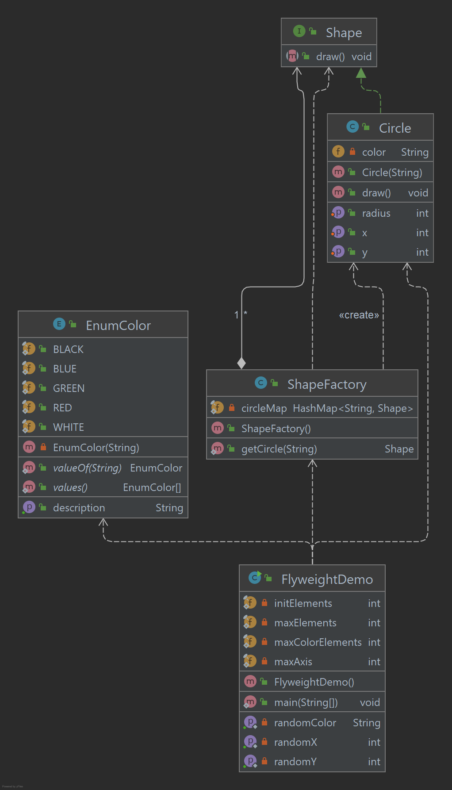

# Flyweight Pattern

O padrão Flyweight é usado principalmente para reduzir o número de objetos criados, para diminuir o consumo de memória
e aumentar o desempenho. Este tipo de padrão de design está incluído no padrão estrutural, pois fornece maneiras 
de diminuir a contagem de objetos, melhorando assim a estrutura dos objetos necessários ao aplicativo. 
O padrão Flyweight tenta reutilizar objetos de tipo semelhante já existentes, armazenando-os e criando um novo objeto 
quando nenhum objeto correspondente for encontrado. Demonstraremos esse padrão desenhando 20 círculos de locais 
diferentes, mas criaremos apenas 5 objetos. Apenas 5 cores estão disponíveis, então a propriedade color é 
usada para verificar objetos Círculo já existentes.

## Implementação

Vamos criar uma interface Shape e uma classe concreta Circle implementando a interface Shape.
Uma classe de fábrica ShapeFactory é definida como a próxima etapa. ShapeFactory possui um HashMap de Circle tendo a 
chave como cor do objeto Circle.
Sempre que surge uma solicitação para criar um círculo de uma cor específica para o ShapeFactory.
ShapeFactory verifica o objeto círculo em seu HashMap, se o objeto do círculo for encontrado, esse objeto é retornado,
caso contrário um novo objeto é criado, armazenado no hashmap para uso futuro e retornado ao cliente.
FlyWeightDemo, nossa classe de demonstração usará ShapeFactory para obter um objeto Shape.
Ele passará informações (red / green / blue/ black / white) para o ShapeFactory para obter o círculo da cor desejada
que ele precisa.

_Use as etapas a seguir para implementar o padrão de design mencionado acima._

### Crie uma interface.

~~~java
public interface Shape {
    void draw();
}
~~~

### Crie classes concretas implementando a interface Shape.

~~~java
public class Circle implements Shape {

    private String color;
    private int x;
    private int y;
    private int radius;

    public Circle(String color) {
        this.color = color;
    }

    public void setX(int x) {
        this.x = x;
    }

    public void setY(int y) {
        this.y = y;
    }

    public void setRadius(int radius) {
        this.radius = radius;
    }

    @Override
    public void draw() {
        System.out.println(
                "Circle: Draw() [Color : " + color + ", x : " + x + ", y :" + y + ", radius :" + radius
        );
    }

}
~~~

### Crie uma Fábrica para gerar objeto de classe concreta com base nas informações fornecidas.

~~~java
public class ShapeFactory {

    private static final HashMap<String, Shape> circleMap = new HashMap<>();

    public static Shape getCircle(String color) {
        Circle circle = (Circle) circleMap.get(color);
        if (circle == null) {
            circle = new Circle(color);
            circleMap.put(color, circle);
            System.out.println("Creating circle of color : " + color);
        }
        return circle;
    }
}
~~~

### Use o Factory para obter o objeto da classe concreta passando uma informação como cor.

~~~java
public class FlyweightDemo {

    private static final int initElements = 0;
    private static final int maxElements = 20;
    private static final int maxColorElements = 5;
    private static final int maxAxis = 100;

    public static void main(String[] args) {

        for (int i = initElements; i < maxElements; ++i) {

            Circle circle = (Circle) ShapeFactory.getCircle(getRandomColor());
            circle.setX(getRandomX());
            circle.setY(getRandomY());
            circle.setRadius(getRandomX() * getRandomY());
            circle.draw();

        }
    }

    private static String getRandomColor() {
        Random random = new Random();
        int indexer = random.nextInt(5);
        EnumColor enumColor = EnumColor.values()[indexer];
        return enumColor.getDescription();
    }

    private static int getRandomX() {
        Random random = new Random();
        return random.nextInt(maxAxis);
    }

    private static int getRandomY() {
        Random random = new Random();
        return random.nextInt(maxAxis);
    }

}
~~~

### Saída exibida

    Creating circle of color : BLUE
    Circle: Draw() [Color : BLUE, x : 39, y :28, radius :1148
    Creating circle of color : RED
    Circle: Draw() [Color : RED, x : 60, y :97, radius :3696
    Circle: Draw() [Color : RED, x : 86, y :90, radius :280
    Circle: Draw() [Color : BLUE, x : 78, y :73, radius :98
    Creating circle of color : WHITE
    Circle: Draw() [Color : WHITE, x : 45, y :81, radius :572
    Circle: Draw() [Color : BLUE, x : 77, y :46, radius :5280
    Creating circle of color : GREEN
    Circle: Draw() [Color : GREEN, x : 35, y :75, radius :4514
    Circle: Draw() [Color : RED, x : 19, y :57, radius :1638
    Circle: Draw() [Color : GREEN, x : 25, y :43, radius :6650
    Circle: Draw() [Color : GREEN, x : 81, y :54, radius :104
    Creating circle of color : BLACK
    Circle: Draw() [Color : BLACK, x : 81, y :0, radius :752
    Circle: Draw() [Color : WHITE, x : 88, y :58, radius :1848
    Circle: Draw() [Color : BLUE, x : 79, y :44, radius :864
    Circle: Draw() [Color : BLACK, x : 73, y :43, radius :3240
    Circle: Draw() [Color : RED, x : 70, y :92, radius :5427
    Circle: Draw() [Color : WHITE, x : 11, y :19, radius :15
    Circle: Draw() [Color : RED, x : 54, y :56, radius :102
    Circle: Draw() [Color : GREEN, x : 0, y :44, radius :2720
    Circle: Draw() [Color : GREEN, x : 24, y :95, radius :2046
    Circle: Draw() [Color : BLUE, x : 6, y :57, radius :6083