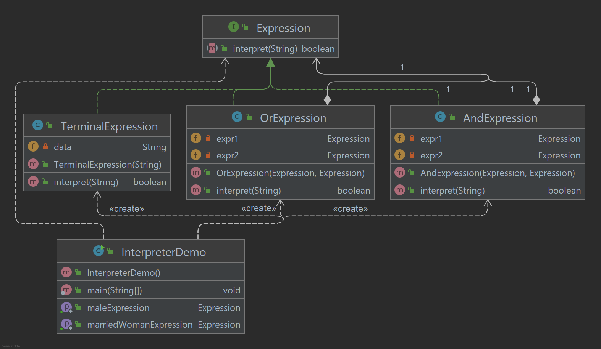

# Interpreter Pattern

O padrão de intérprete fornece uma maneira de avaliar a gramática ou expressão do idioma. Esse tipo de padrão se 
enquadra nos padrões comportamentais. Este padrão envolve a implementação de uma interface de expressão que instrui 
a interpretação de um contexto específico. Este padrão é usado na análise SQL, mecanismo de processamento de 
símbolos, etc.

## Implementação

Vamos criar uma interface Expression e classes concretas implementando a ExpressionInterface. 
É definida uma classe TerminalExpression que atua como principal intérprete do contexto em questão. 
Outras classes OrExpression, AndExpression são usadas para criar expressões combinacionais. 
InterpreterDemo, nossa classe de demonstração usará a classe Expression para criar regras e demonstrar a análise de expressões.

_Use as etapas a seguir para implementar o padrão de design mencionado acima._

### Crie uma interface de expressão.

~~~java
public interface Expression {
    boolean interpret(String context);
}
~~~

### Crie classes concretas implementando a interface Expression.

~~~java
public class TerminalExpression implements Expression {

    private String data;

    public TerminalExpression(String data) {
        this.data = data;
    }

    @Override
    public boolean interpret(String context) {
        return context.contains(data);
    }

}
public class OrExpression implements Expression {

    private Expression expr1 = null;
    private Expression expr2 = null;

    public OrExpression(Expression expr1, Expression expr2) {
        this.expr1 = expr1;
        this.expr2 = expr2;
    }

    @Override
    public boolean interpret(String context) {
        return expr1.interpret(context) || expr2.interpret(context);
    }

}

public class AndExpression implements Expression {

    private Expression expr1 = null;
    private Expression expr2 = null;

    public AndExpression(Expression expr1, Expression expr2) {
        this.expr1 = expr1;
        this.expr2 = expr2;
    }

    @Override
    public boolean interpret(String context) {
        return expr1.interpret(context) && expr2.interpret(context);
    }

}
~~~

### InterpreterDemo usa a classe Expression para criar regras e depois analisá-las.

~~~java
public class InterpreterDemo {

    public static Expression getMaleExpression() {
        Expression captain = new TerminalExpression("Steve");
        Expression thor = new TerminalExpression("Thor");
        return new OrExpression(captain, thor);
    }

    public static Expression getMarriedWomanExpression() {
        Expression natasha = new TerminalExpression("Natasha");
        Expression married = new TerminalExpression("Married");
        return new AndExpression(natasha, married);
    }

    public static void main(String[] args) {

        Expression isMale = getMaleExpression();
        Expression isMarriedWoman = getMarriedWomanExpression();

        System.out.println("Steve is male? " + isMale.interpret("Steve"));
        System.out.println("Natasha is a married women? " + isMarriedWoman.interpret("Married Hulk"));

    }

}
~~~

### Saída exibida

    Steve is male? true
    Natasha is a married women? false