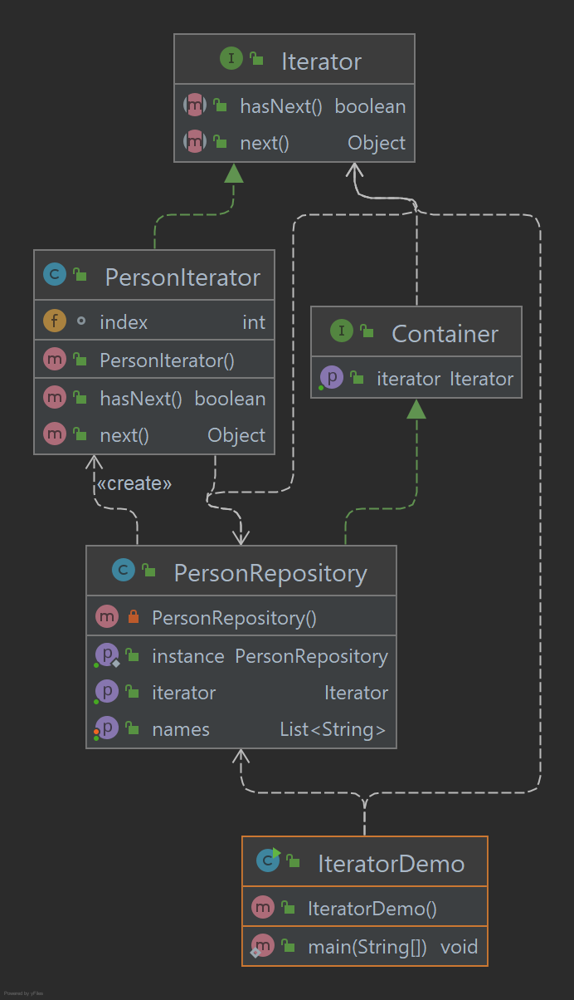

# Iterator Pattern

O padrão Iterator é um padrão de design muito comumente usado em ambientes de programação Java e .Net. 
Este padrão é usado para obter uma forma de acessar os elementos de um objeto de coleção de maneira sequencial, 
sem qualquer necessidade de conhecer sua representação subjacente. O padrão do iterador se enquadra na 
categoria de padrão comportamental.

## Implementação

Vamos criar uma interface Iterator que narra o método de navegação e uma interface Container que retorna o iterador. 
Classes concretas que implementam a interface Container serão responsáveis por implementar a interface Iterator e 
utilizá-la IteratorDemo, nossa classe demo usará NamesRepository, uma implementação de classe concreta para imprimir 
Names armazenados como uma coleção em NamesRepository.

_Use as etapas a seguir para implementar o padrão de design mencionado acima._

### Crie as interfaces.

~~~java
public interface Iterator {
    boolean hasNext();
    Object next();
}

public interface Container {
    Iterator getIterator();
}
~~~

### Crie uma classe concreta implementando a interface Container. Esta classe possui a classe interna NameIterator que implementa a interface Iterator.

~~~java
public class PersonRepository implements Container {

    private static PersonRepository instance;
    private List<String> names;

    private PersonRepository() {
    }

    public static PersonRepository getInstance() {
        if (instance == null) {
            instance = new PersonRepository();
        }
        return instance;
    }

    public List<String> getNames() {
        return names;
    }

    public void setNames(List<String> names) {
        this.names = names;
    }

    @Override
    public Iterator getIterator() {
        return new PersonIterator();
    }

}

public class PersonIterator implements Iterator {

    int index;

    @Override
    public boolean hasNext() {
        return index < (long) PersonRepository.getInstance().getNames().size();
    }

    @Override
    public Object next() {
        if (this.hasNext()) {
            return PersonRepository.getInstance().getNames().get(index++);
        }
        return null;
    }

}
~~~

### Use o NameRepository para obter o iterador e imprimir nomes.

~~~java
public class IteratorDemo {

    public static void main(String[] args) {

        List<String> list = new ArrayList<>();
        list.add("Natasha");
        list.add("Tony Stark");
        list.add("Steve Rogers");
        list.add("Loki");

        PersonRepository personRepository = PersonRepository.getInstance();
        personRepository.setNames(list);

        for (Iterator iterator = personRepository.getIterator(); iterator.hasNext(); ) {
            System.out.println("Name : " + iterator.next());
        }

    }
}
~~~

### Saída exibida

    Name : Natasha
    Name : Tony Stark
    Name : Steve Rogers
    Name : Loki