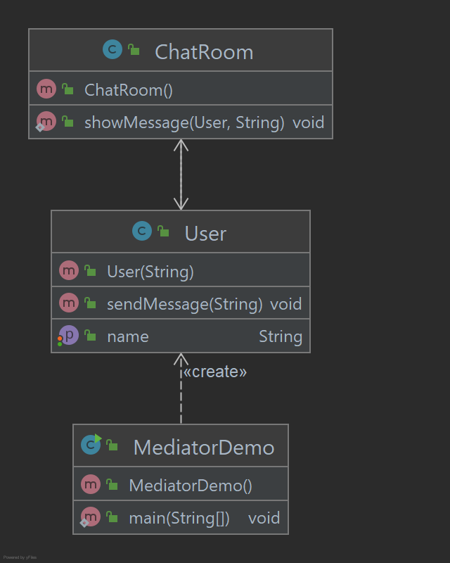

# Mediator Pattern

O padrão mediador é usado para reduzir a complexidade da comunicação entre vários objetos ou classes. 
Este padrão fornece uma classe mediadora que normalmente lida com todas as comunicações entre diferentes classes e
suporta fácil manutenção do código por meio de acoplamento fraco. O padrão mediador se enquadra na categoria de 
padrão comportamental.

## Implementação

Estamos demonstrando o padrão de mediador pelo exemplo de uma sala de bate-papo onde vários usuários podem enviar 
mensagens para a sala de bate-papo e é responsabilidade da sala de bate-papo mostrar as mensagens a todos os usuários.
Criamos duas classes ChatRoom e User. Os objetos de usuário usarão o método ChatRoom para compartilhar suas mensagens. 
MediatorDemo, nossa classe de demonstração usará objetos User para mostrar a comunicação entre eles.

_Use as etapas a seguir para implementar o padrão de design mencionado acima._

### Crie uma classe mediadora.

~~~java
public class ChatRoom {

    public static void showMessage(User user, String message) {
        System.out.println(new Date() + " [" + user.getName() + "] : " + message);
    }

}
~~~

### Criar classe de usuário

~~~java
public class User {
    private String name;

    public User(String name) {
        this.name = name;
    }

    public String getName() {
        return name;
    }

    public void setName(String name) {
        this.name = name;
    }

    public void sendMessage(String message) {
        ChatRoom.showMessage(this, message);
    }
}
~~~

### Use o objeto User para mostrar as comunicações entre eles.

~~~java
public class MediatorDemo {

    public static void main(String[] args) {
        User tonyStark = new User("Tony Stark");
        User Steve = new User("Steve Rogers");
        tonyStark.sendMessage("Hi! Tony!");
        Steve.sendMessage("Hello! Steve!");
    }
}
~~~

### Saída exibida

    Thu Jul 11 06:25:12 BRT 2024 [Tony Stark] : Hi! Tony!
    Thu Jul 11 06:25:12 BRT 2024 [Steve Rogers] : Hello! Steve!