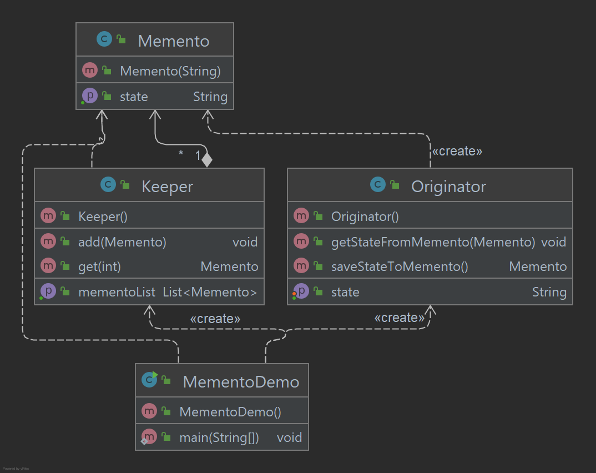

# Memento Pattern

O padrão Memento é usado para reduzir onde queremos restaurar o estado de um objeto para um estado anterior. 
O padrão Memento se enquadra na categoria de padrão comportamental.

## Implementação

O padrão Memento usa três classes de atores. Memento contém o estado de um objeto a ser restaurado. 
O originador cria e armazena estados em objetos Memento e no objeto Caretaker, que é responsável por restaurar 
o estado do objeto do Memento. Criamos as classes Memento, Originator e CareTaker. MementoDemo, nossa classe de 
demonstração usará objetos Keeper e Originator para mostrar a restauração dos estados dos objetos.

_Use as etapas a seguir para implementar o padrão de design mencionado acima._

### Crie uma classe Memento.

~~~java
public class Memento {

    private final String state;

    public Memento(String state) {
        this.state = state;
    }

    public String getState() {
        return state;
    }

}
~~~

### Crie uma classe Originator.

~~~java
public class Originator {

    private String state;

    public void setState(String state) {
        this.state = state;
    }

    public String getState() {
        return state;
    }

    public Memento saveStateToMemento() {
        return new Memento(state);
    }

    public void getStateFromMemento(Memento Memento) {
        state = Memento.getState();
    }

}
~~~

### Crie uma classe Keeper.

~~~java
public class Keeper {

    private List<Memento> mementoList = new ArrayList<>();

    public void add(Memento state) {
        mementoList.add(state);
    }

    public Memento get(int index) {
        return mementoList.get(index);
    }

    public List<Memento> getMementoList() {
        return mementoList;
    }
}
~~~

### Use objetos Keeper e Originator.

~~~java
public class MementoDemo {

    public static void main(String[] args) {

        Originator originator = new Originator();
        Keeper keeper = new Keeper();

        originator.setState("State #1");
        originator.setState("State #2");
        keeper.add(originator.saveStateToMemento());

        originator.setState("State #3");
        keeper.add(originator.saveStateToMemento());

        originator.setState("State #4");
        System.out.printf("Current State: %s \n", originator.getState());

        for (Memento k : keeper.getMementoList()) {
            System.out.printf("State saved %s \n", k.getState());
        }

    }

}
~~~

### Saída exibida

    Current State: State #4
    State saved State #2
    State saved State #3 