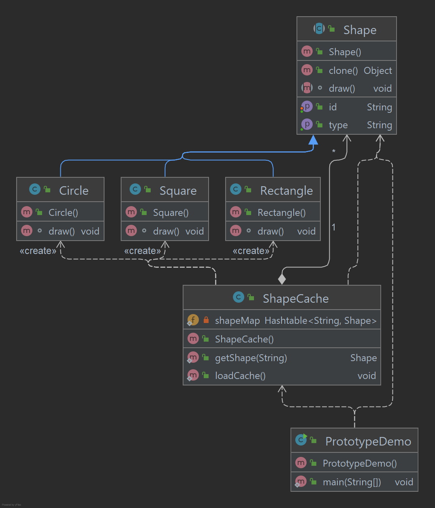

# Prototype Pattern

O Prototype Pattern se refere à criação de objetos duplicados, mantendo o desempenho em mente. Esse tipo de padrão de
design vem sob o padrão de criação. Este padrão envolve a implementação de uma interface Cloneable para criar um clone
do objeto atual. Este padrão é usado quando a criação de um objeto diretamente é cara. Por exemplo, um objeto deve ser
criado após uma operação cara do banco de dados. Podemos armazenar o objeto em cache, retorna seu clone na próxima
solicitação e atualize o banco de dados como e quando necessário, reduzindo assim chamadas ao banco de dados.

## Implementação

Vamos criar uma classe abstrata Shape e classes concretas estendendo a classe Shape. Uma classe ShapeCache é definida
como uma próxima etapa que armazena objetos de forma em um Hashtable e retorna seu clone quando solicitado.

PrototypPatternDemo, nossa classe demo usará a classe ShapeCache para obter um objeto Shape.

_Use as etapas a seguir para implementar o padrão de design mencionado acima._

### Crie uma classe abstrata implementando a interface Clonable.

~~~java
public abstract class Shape implements Cloneable {

    private String id;
    protected String type;

    abstract void draw();

    public String getType() {
        return type;
    }

    public String getId() {
        return id;
    }

    public void setId(String id) {
        this.id = id;
    }

    public Object clone() {
        Object clone = null;
        try {
            clone = super.clone();
        } catch (CloneNotSupportedException e) {
            e.printStackTrace();
        }
        return clone;
    }
}
~~~

### Crie classes concretas estendendo a classe acima.

~~~java
public class Circle extends Shape {

    public Circle() {
        type = "Circle";
    }

    @Override
    void draw() {
        System.out.println("Circle -> draw()");
    }
}

public class Rectangle extends Shape {

    public Rectangle() {
        type = "Rectangle";
    }

    @Override
    void draw() {
        System.out.println("Rectangle -> draw()");
    }
}

public class Square extends Shape {

    public Square() {
        type = "Square";
    }

    @Override
    void draw() {
        System.out.println("Square -> draw()");
    }
}
~~~

### Crie uma classe para obter classes concretas do banco de dados e armazená-las em um Hashtable.

~~~java
public class ShapeCache {

    private static Hashtable<String, Shape> shapeMap = new Hashtable<>();

    public static Shape getShape(String shapeId) {
        Shape cachedShape = shapeMap.get(shapeId);
        return (Shape) cachedShape.clone();
    }

    public static void loadCache() {
        Circle circle = new Circle();
        circle.setId("1");
        shapeMap.put(circle.getId(), circle);
        Square square = new Square();
        square.setId("2");
        shapeMap.put(square.getId(), square);
        Rectangle rectangle = new Rectangle();
        rectangle.setId("3");
        shapeMap.put(rectangle.getId(), rectangle);
    }

}
~~~

### PrototypePatternDemo usa a classe ShapeCache para obter clones de formas armazenadas em um Hashtable.

~~~java
public class PrototypePatternDemo {

    public static void main(String[] args) {

        Shape clonedShape;
        ShapeCache.loadCache();

        clonedShape = ShapeCache.getShape("1");
        System.out.println("Shape -> " + clonedShape.getType());

        clonedShape = ShapeCache.getShape("2");
        System.out.println("Shape -> " + clonedShape.getType());

        clonedShape = ShapeCache.getShape("3");
        System.out.println("Shape -> " + clonedShape.getType());

    }
}
~~~

### Saída exibida

    Shape -> Circle
    Shape -> Square
    Shape -> Rectangle