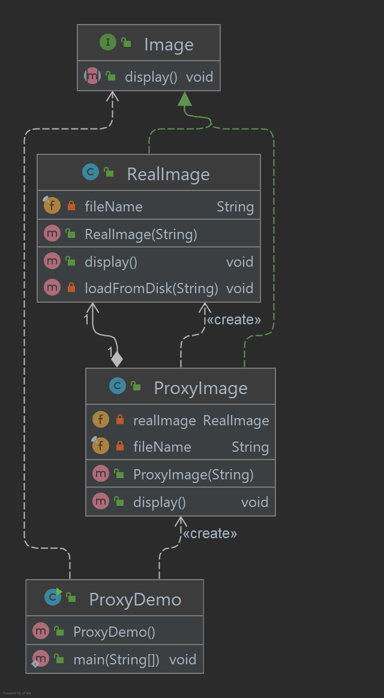

# Proxy Pattern

No padrão Proxy, uma classe representa a funcionalidade de outra classe. Este tipo de padrão de design está incluído no 
padrão estrutural. No padrão Proxy, criamos um objeto com objeto original para fazer a interface de sua funcionalidade 
com o mundo exterior.

## Implementação

Vamos criar uma interface Image e classes concretas implementando a interface Image.
ProxyImage é uma classe proxy para reduzir o consumo de memória do carregamento de objetos RealImage. 
ProxyDemo, nossa classe de demonstração usará ProxyImage para fazer com que um objeto Image seja carregado 
e exibido conforme necessário.

_Use as etapas a seguir para implementar o padrão de design mencionado acima._

### Crie a interface.

~~~java
public interface Image {
    void display();
}
~~~

### Crie classes concretas implementando a interface Image.

~~~java
public class RealImage implements Image {

    private final String fileName;

    public RealImage(String fileName) {
        this.fileName = fileName;
        loadFromDisk(fileName);
    }

    @Override
    public void display() {
        System.out.println("Displaying " + fileName);
    }

    private void loadFromDisk(String fileName) {
        System.out.println("Loading " + fileName);
    }

}

public class ProxyImage implements Image {

    private RealImage realImage;
    private final String fileName;

    public ProxyImage(String fileName) {
        this.fileName = fileName;
    }

    @Override
    public void display() {
        if (realImage == null) {
            realImage = new RealImage(fileName);
        }
        realImage.display();
    }
}
~~~

### Use ProxyImage para obter o objeto da classe RealImage quando necessário.

~~~java
public class ProxyDemo {

    public static void main(String[] args) {

        Image image = new ProxyImage("test_100mb.png");
        image.display();
        System.out.println("");
        image.display();

    }
}
~~~

### Saída exibida

    Loading test_100mb.png
    Displaying test_100mb.png
    
    Displaying test_100mb.png