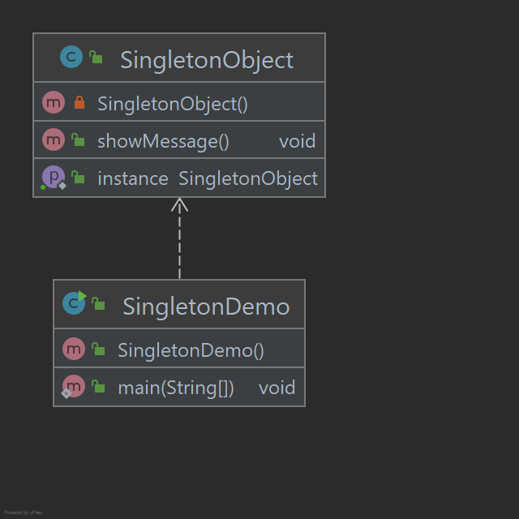

# Singleton Pattern

O padrão Singleton é um dos padrões de design mais simples em Java. Este tipo de padrão de design vem sob o padrão de
criação, pois esse padrão fornece uma das melhores maneiras de criar um objeto. Este padrão envolve uma única classe que
é responsável por criar o próprio objeto, certificando-se de que apenas um único objeto seja criado. Esta classe fornece
uma maneira de acessar seu único objeto que pode ser acessado diretamente sem a necessidade de instanciar o objeto da
classe.

## Implementação

Vamos criar uma classe SingletonObject. A classe SingletonObject tem seu construtor como privado e ter uma instância
estática de si mesmo.

A classe SingletonObject fornece um método estático para obter sua instância estática para fora dela.
SingletonPatternDemo, nossa classe de demonstração usará a classe SingletonObject para obter uma instancia do objeto
SingletonObject.

_Use as etapas a seguir para implementar o padrão de design mencionado acima._

### Crie uma class Singleton.

~~~java
public class SingletonObject {

    private static SingletonObject instance;

    private SingletonObject() {
    }

    public static SingletonObject getInstance() {
        if (instance == null) {
            instance = new SingletonObject();
        }
        return instance;
    }

    public void showMessage() {
        System.out.println("SingletonObject -> showMessage()");
    }

}
~~~

### Obtenha o único objeto da classe singleton.

~~~java
public class SingletonPatternDemo {

    public static void main(String[] args) {

        SingletonObject singletonObject = SingletonObject.getInstance();
        singletonObject.showMessage();

    }
}
~~~

### Saída exibida

    SingletonObject -> showMessage()